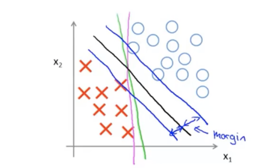
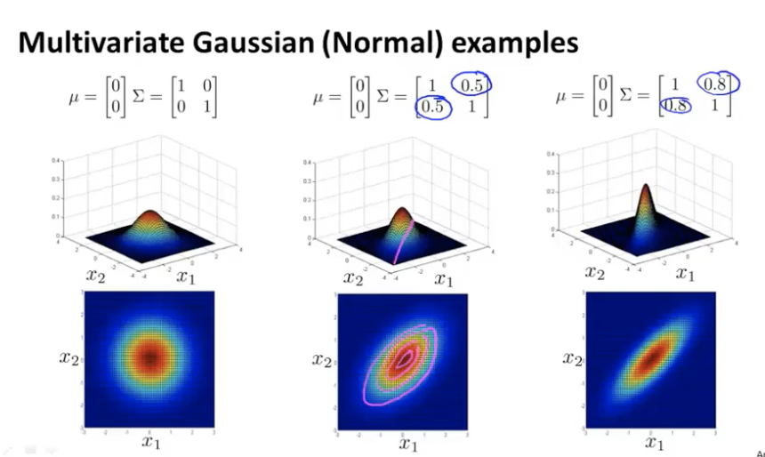
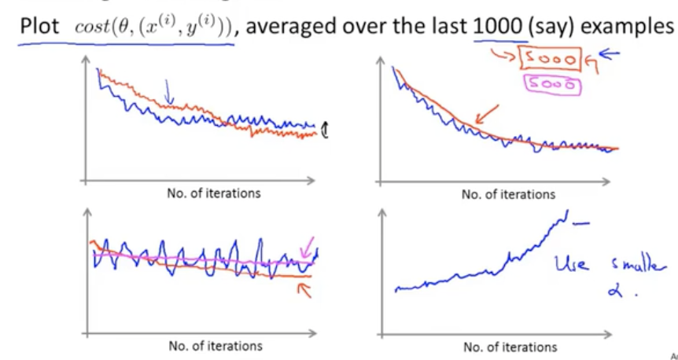

# Introduction

Field of study that gives computers the ability to learn without being explicitly programmed.

## Supervised Learning

GIve the dataset with the "right answers".

* Classification Problem: discrete valued output (0, 1, 2, ...)
* Regression: Predict continous valued output

## Unsupervised Learning

The dataset have the same label or no labels.

鸡尾酒问题：两个人同时讲话，两个不同距离的麦克风录到了声音的不同组合。-->奇异值分解

# 单变量线性回归 Linear Regression with One Variable

## Model Description

$$m$$: number of training examples

$$x$$'s: "input" variable/features

$$y$$'s: "output" variable /"target" training example

$$(x,y)$$: one triaing example

$$(x^{(i)}, y^{(i)})$$: $$i$$th training example

Training Set -> Learning Algorithm -> $$h$$

* $$h$$: hypothesis. $$h$$ maps from $$x$$'s to $$y$$'s.
* **linear regression with one variable**: $$h_{\theta}(x)=\theta_0+\theta_1x$$, also called **univariate linear regression**.

## Cost Function

Idea: Choose $$\theta_0, \theta_1$$ so that $$h_{\theta}(x)$$ is close to $$y$$ for our training examples $$(x, y)$$.

Object: $$minimize_{\theta_0, \theta_1}\frac{1}{2m}\sum_{i=1}^m(h_{\theta}(x^{(i)})-y^{(i)})^2$$, $$m$$ is the number of training examples.

We definite a cost function $$J(\theta_0, \theta_1)=\frac{1}{2m}\sum_{i=1}^m(h_{\theta}(x^{(i)})-y^{(i)})^2$$, and we are to: $$minimize_{\theta_0, \theta_1} J(\theta_0, \theta_1)$$. It is also called **square error cost function**.

**Simplified**:

$$h_\theta(x)=\theta_1x$$, meaning that $$\theta_0 = 0$$. For fixed $$\theta_1$$, this is a function of $$x$$.

now we have $$J(\theta_1)=\frac{1}{2m}\sum_{i=1}^m(h_{\theta}(x^{(i)})-y^{(i)})^2$$. This is a function of $$\theta_1$$.

Each value of $$\theta_1$$ corresponds to a different hypothesis, and derive a different value of $$J(\theta_1)$$.

**Original:**

Use contour plots/contour figures below:

## Gradient Descent

We have function $$J(\theta_0,\theta_1)$$, and we want $$min_{\theta_0, \theta_1}J(\theta_0, \theta_1)$$

**Outline:**

* start with some $$\theta_0, \theta_1$$
* keep changing $$\theta_0, \theta_1$$ to reduce $$J(\theta_0, \theta_1)$$ until we hopefully end up at a minimum.

Starting from different starting point, you may end up with different local optimum(局部最优解).

**Gradient decent algorithm:**

repeat until convergence(收敛){

​    $$\theta_j := \theta_j-\alpha \frac{\partial}{\partial \theta_j}J(\theta_0, \theta_1)$$ (for $$j=0$$ and $$j=1$$)

}

* $$\alpha$$: learning rate, controls how big the step downhill
* $$\frac{\partial}{\partial \theta_j}J(\theta_0, \theta_1)$$: derivative term.

We need to **simultaneously** update $$\theta_0$$ and $$\theta_1$$.

 $$temp_0 := \theta_0-\alpha \frac{\partial}{\partial \theta_0}J(\theta_0, \theta_1)$$

 $$temp_1 := \theta_1-\alpha \frac{\partial}{\partial \theta_1}J(\theta_0, \theta_1)$$

$$\theta_0 := temp_0$$ 

$$\theta_1 := temp-1$$

Gradient descendant can converge to a local minimum, even with the learning rate $$\alpha$$ fixed.

* As we approach a local minnimum, gradient descent will **automatically take smaller steps** (the dirivative is coming close to 0). So, no need ro decrease $$\alpha$$ over time. 

**Into the linear regression:**

$$\frac{\partial}{\partial \theta_j}J(\theta_0, \theta_1)=\frac{\partial}{\partial \theta_j}*\frac{1}{2m}\sum_{i=1}^m(h_{\theta}(x^{(i))}-y^{(i)})^2=\frac{\partial}{\partial \theta_j}*\frac{1}{2m}\sum_{i=1}^m(\theta_0+\theta_1x^{(i)}-y^{(i)})^2$$

* $$j=0: \frac{\partial}{\partial \theta_0}J(\theta_0, \theta_1)=\frac{1}{m}\sum_{i=1}^m(h_{\theta}x^{(i))}-y^{(i)})$$
* $$j=1: \frac{\partial}{\partial \theta_1}J(\theta_0, \theta_1)=\frac{1}{m}\sum_{i=1}^m(h_{\theta}x^{(i))}-y^{(i)})*x^{(i)}$$

Gradinet descent algorithm:

repeat until convergence(收敛){

​    $$\theta_0 := \theta_0-\alpha \frac{1}{m}\sum_{i=1}^m(h_{\theta}x^{(i)}-y^{(i)})$$

​    $$\theta_1 := \theta_1-\alpha \frac{1}{m}\sum_{i=1}^m(h_{\theta}x^{(i)}-y^{(i)})*x^{(i)}$$

} remember to update $$\theta_0, \theta_1$$ simultaneously.

The cost funtion of a linear regression is always a convex function(凸函数). It does not have a local optimum, it only has the global optimum.

**"Batch" Gradient Descent:** each step of gradient descent uses all the training examples.($$\sum_{i=1}^m(h_{\theta}x^{(i))}-y^{(i)})$$)

# Linear Algebra Review

## Matrix and Vectors

Dimension of matrix: number of rows X number of columns. e.g. $$2\times 3$$

$$A_{i,j}$$: "$$i,j$$ entry" in the $$i^{th}$$ row, $$j^{th}$$ column

Vector: an $$n \times 1$$ Matrix

## Matrix-vector multiplication

$$A$$: $$m \times n$$ Matrix 

$$x$$: $$n\times 1$$ Matrix($$n$$-dimensional vector)

$$A \times x=y$$, $$y$$: $$m$$-dimensional vector

To get $$y_i$$,multiply $$A$$'s $$i^{th}$$ row with elemnets of vector $$x$$, and add them up.

## Matrix-Matrix multiplication

$$A$$: $$m \times n$$ Matrix 

$$B$$: $$n \times o$$ Matrix 

$$A \times B = C$$, $$C$$ is a $$m\times o$$ matrix

The $$i^{th}$$ column of the matrix $$C$$ is obtained by multiplying $$A$$ with the $$i^{th}$$ colimn of $$B$$ (For $$i=1,2,...o$$).

* $$A \times B \neq B \times A$$: not commutative 不可交换
* $$A \times (B \times C)=(A\times B)\times C$$: enjoy the associative property 服从结合律
* **Identity Matrix**: Denoted as $$I$$, or $$I_{n\times n}$$. 对角线元素为1，其余都为0
  * For any matrix $$A_{m\times n}$$, $$A\cdot I = I \cdot A = A$$

## Inverse and Transpose

**Matrix Inverse**: if $$A$$ is an $$m \times m$$ matrix(**square matrix**), and if has an inverse, $$AA^{-1}=A^{-1}A=I$$

* Matrices that do not have an inverse are **"singular"** or **"degenerate"** 奇异矩阵/退化矩阵

**Matrix Transpose**:

Let $$A$$ be an $$m\times n$$ matrix, and let $$B=A^T$$. Then $$B$$ is an $$n \times m$$ matrix, and $$B_{ij}=A_{ji}$$

# Linear Regresiion with multiple variables

## Multiple Features

$$n$$: the number of features

$$x^{(i)}$$: input(features) of $$i^{th}$$ training example

$$x_j^{(i)}$$: value of feature $$j$$ in $$i^{th}$$ training example

$$h_{\theta}(x)=\theta_0+\theta_1x_1+\theta_2x_2+...+\theta_xx_n$$

For convenience of notation, define $$x_0=1$$ ($$x_0^{(i)}=1$$)

$$X=[x_0, x_1, x_2, ..., x_n]^T \in R^{n+1}$$

$$\Theta=[\theta_0, \theta_1, \theta_2,...,\theta_n]^T\in R^{n+1}$$

Then: $$h_\theta(x)=\Theta^TX$$ -> **Multivariate Linear Regression**

## Multivariate Gradient Descent

Hypothetis: $$h_{\theta}(x)=\theta_0+\theta_1x_1+\theta_2x_2+...+\theta_xx_n$$

Parameters: $$\Theta=[\theta_0, \theta_1, \theta_2,...,\theta_n]^T\in R^{n+1}$$

Cost function: $$J(\Theta)=\frac{1}{2m}\sum_{i=1}^m(h_{\theta}(x^{(i)})-y^{(i)})^2$$

Gradient Descent:

repeat{

​    $$\theta_j := \theta_j-\alpha \frac{\partial}{\partial \theta_j}J(\theta_0,..., \theta_n)$$ (simultaneously update for every $$j=0, ..., n$$)

​    ( $$\frac{\partial}{\partial \theta_j}J(\Theta)=\frac{1}{m}\sum_{i=1}^m(h_{\theta}x^{(i)}-y^{(i)})*x^{(i)}_j$$)

}

* $$\theta_0 := \theta_0-\alpha\frac{1}{m}\sum_{i=1}^m(h_{\theta}x^{(i)}-y^{(i)})*x^{(i)}_0$$
* $$\theta_1 := \theta_0-\alpha\frac{1}{m}\sum_{i=1}^m(h_{\theta}x^{(i)}-y^{(i)})*x^{(i)}_1$$
* $$\theta_2 := \theta_0-\alpha\frac{1}{m}\sum_{i=1}^m(h_{\theta}x^{(i)}-y^{(i)})*x^{(i)}_2$$
* ......

## Feature Scaling

**Idea: make sure features are on a similar scale.**

e.g: $$x_1$$: size (0-2000 feet2), $$x_2$$: number of bedrooms(1-5)

**After Scaling**:

* $$x_1$$: size/2000
* $$x_2$$: number of bedrooms/5

**Feature Scaling: Get every feature into approxiamtely a $$-1 \leq x_i \leq 1$$ range.**

**Mean Normalization:** Replace $$x_i$$ with $$x_i-u_i$$ to make features have approximatelt zero mean **(Do not apply to $$x_0=1$$)**

* $$x_1=\frac{size-1000}{2000}$$
* $$x_2=\frac{No.bedrooms-2}{5}$$

More generally, $$x_1 = \frac{x_1-u_1}{s_1}$$

* $$u_1$$: avarage value of $$x_1$$
* $$s_1$$: range value (max-min), also called standard deviation

## Learning rate 

$$J(\Theta)$$ should decrease after every iteration.

Example automatic convergence test:

* Declare convergence if $$J(\Theta)$$ decreases by less than $$10^{-3}$$ in one iteration.

But if $$\alpha$$ is too small, gradient descent can be very slow.

Summary:

* If $$\alpha$$ is too small: slow convergence.
* if $$\alpha$$ is too large: $$J(\Theta)$$ may not decrease on every iteration, may not converge.
* To choose $$\alpha$$, try $$..., 0.001, 0.003, 0.01, 0.03, 0.1, 0.3, 1, ...$$

## Features and Polynomial Regression

Polynomial Regression:

$$h_{\theta}(x)=\theta_0+\theta_1x_1+\theta_2x_2+\theta_3x_3=\theta_0+\theta_1(size)+\theta_2(size)^2+\theta_3(size)^3$$  

* $$x_1=(size)$$
* $$x_2=(size)^2$$
* $$x_3=(size)^3$$

**It's important to do feature scaling.**

## Normal Equation

Method to solve for $$\Theta$$ analytically.

$$\theta \in R^{n+1}, $$ $$J(\Theta)=\frac{1}{2m}\sum_{i=1}^m(h_{\theta}(x^{(i)})-y^{(i)})^2$$, $$\frac{\partial}{\partial \theta_j}J(\Theta)=...=0$$, for every$$j$$.

* Solve for $$\theta_0, \theta_1, ..., \theta_n$$
* $$\Theta = (X^TX)^{-1}X^Ty$$

Generally, we have $$(x^{(1)}, y^{(1)}), ..., (x^{(m)}, y^{(m)})$$ and $$n$$ features.

$$x^{(i)}=[x_0^{(i)}, x_1^{(i)}, ...,x_n^{(i)}] \in R^{n+1}$$

$$X:m\times (n+1), y:$$$$m$$-dimensional vector

| Gradient Descent                     | Normal Equation                                              |
| ------------------------------------ | ------------------------------------------------------------ |
| Need to choose $$\alpha$$.           | No need to choose $$\alpha$$.                                |
| Needs many iterations.               | Don't need to iterate.                                       |
| Works well even when $$n$$ is large. | Need to compute $$ (X^TX)^{-1}$$, $$O(n^3)$$, slow if $$n$$ is large |

**For the specific model of linear regression, normal equation is an alternative of gradient descent.**

Question: What if $X^TX$ is non-invertible? Computer can still handle the questions.

*   Redundant Features (linearly dependent)
    *   $x_1$: size in feet2
    *   $x_2$: size in m2
*   Too many features ($m\leq n$)
    *   delete some features or use regularization.

# Classification

$y \in \{0,1\}$

*   0: Negative class
*   1: Positive class

Threshold classifier output $h_\theta(x)$ at 0.5:

*   if $h_\theta(x) \geq 0.5$, predict "$y=1$"
*   if $h_\theta(x) <0.5$, predict "$y=0$"

**Logistic Regression**: $0 \leq h_\theta(x)\leq 1$ actually a classification problem.

## Hypothesis Representation

$h_\theta(x) = g(\theta^Tx)$

Sigmoid Function / Logistic Function: $g(z) = \frac{1}{1+e^{-z}}$

Then, $h_\theta(x) = \frac{1}{1+e^{-\theta^Tx}}$

**Interpretation of Hypothesis Output:**

$h_\theta(x)$: estimated probability that $y=1$ on input $x$.

*   If $x=[x_0, x_1]^T=[1, tumorSize]^T, h_\theta(x)=0.7$, means the 70% chance of tumor being malignant
*   $h_\theta(x)=p(y=1|x;\theta)$: probability that $y=1$, given $x$, parameterized by $\theta$.
*   $y=$ 0 or 1
    *   $P(y=0|x;\theta)+P(y=1|x;\theta)=1$
    *   $P(y=0|x;\theta) = 1-P(y=1|x;\theta)$

## Decision Boundary

Suppose predict "$y=1$" if $h_\theta(x) \geq 0.5$

*   That is, when $\theta^Tx \geq 0$

Predict "$y=0$" if $h_\theta(x) <0.5$

*   That is, when $\theta^Tx<0$

$h_\theta(x)=g(\theta_0+\theta_1x_1+\theta_2x_2)$

When $\theta=[-3,1,1]^T$, predict "$y=1$" if $-3+x_1+x_2\geq0$

**Non-linear decision boundaries**:

$h_\theta(x)=g(\theta_0+\theta_1x_1+\theta_2x_2+\theta_3x_1^2+\theta_4x_2^2)$

When $\theta=[-1, 0, 0, 1, 1]^T$, predict "$y=1$" if $-1+x_1^2+x_2^2 \geq 0$.

We use $\theta$ **but not the training set** to difine decision boundary.

*   The training set may be used to fit the parameter $\theta$.

## Cost Function

Training set: $\{(x^{(1)}, y^{(1)}), (x^{(2)}, y^{(2)}),..., (x^{(m)}, y^{(m)})\}$

$m$ examples $x \in [x_0, x_1, ..., x_n]^T, x_0=1, y \in \{0,1\}$ 

$h_\theta(x)=\frac{1}{1+e^{-\theta^Tx}}$

How to choose parameter $\theta$?

**Logistic Regression cost function:**
$$
cost(h_\theta(x), y)= \begin{cases}
-log(h_\theta(x)),\quad &y=1 \\
-log(1-h_\theta(x)),\quad &y=0
\end{cases}
$$

$cost=0$ if $y=1. h_\theta(x)=1$.

* But as $h_\theta(x) \rightarrow 0$, $cost \rightarrow \infty$
* Captures intuition that if $h_\theta(x)=0$ (predict $P(y=1|x;\theta)=0$), but actually $y=1$, we will penalize learning algorithm by a very large cost.

$cost=0$ if $y=0. h_\theta(x)=0$.

* But as $h_\theta(x) \rightarrow 1$, $cost \rightarrow \infty$
* Captures intuition that if $h_\theta(x)=1$ (predict $P(y=1|x;\theta)=1$), but actually $y=0$, we will penalize learning algorithm by a very large cost.

## Simplified cost function and gradient descent

$J(\theta)=\frac{1}{m}\sum_{i=1}^mCost(h_\theta(x^{(i)}), y^{(i)})$

$cost(h_\theta(x), y)= \begin{cases}
-log(h_\theta(x)),\quad &y=1 \\
-log(1-h_\theta(x)),\quad &y=0
\end{cases}$

Note: $y\in \{0,1\}$ always

**Equivalent**:$cost(h_\theta(x), y)=-ylog(h_\theta(x))-(1-y)log(1-h_\theta(x))$

so, $J(\theta)=\frac{1}{m}\sum_{i=1}^mCost(h_\theta(x^{(i)}), y^{(i)})=-\frac{1}{m}\sum_{i=1}^m[y^{(i)}log(h_\theta(x^{(i)})+(1-y^{(i)})log(1-h_\theta(x^{(i)}))]$

To fit $\theta$, we should $min_{\theta}J(\theta)$

To make a prediction given new $x$, output: $h_\theta(x)=\frac{1}{1+e^{-\theta^Tx}}$, which means $p(y=1|x;\theta)$

**Gradient Descent:**

$J(\theta)=-\frac{1}{m}\sum_{i=1}^m[y^{(i)}log(h_\theta(x^{(i)})+(1-y^{(i)})log(1-h_\theta(x^{(i)}))]$

Want $min_{\theta}J(\theta)$

Repeat {

​    $\theta_j:=\theta_j-\alpha\frac{\partial}{\partial\theta_j}J(\theta)$ (simultaneously update all $\theta_j$)

}

In that, $\frac{\partial}{\partial\theta_j}J(\theta) = \frac{1}{m}\sum_{i=1}^m[h_\theta(x^{(i)})-y^{(i)}]x^{(i)}_j$, **looks identical to linear regression**.

## Advanced Optimization

Cost Function $J(\theta)$, want $min_\theta J(\theta)$

Given $\theta$, we have code that can compute:

* $J(\theta)$
* $\frac{\partial}{\partial\theta_j}J(\theta)$   (for $j=0,1,...,m$)

Optimazation algorithms:

* Gradient Descent
* Conjugate gradient
* BFGS
* L-BFGS

The last three algorithms:

* Advantages:
  * No need to manually pick $\alpha$
  * Often faster than gradient descent
* Disadvantages:
  * More complex

## Multi-class classification: one-vs-all

Example:

* Email folding/tagging: Work; Friends; Family; Hobby
* Medical diagrams: Not ill; Cold; Flu
* Weather: Sunny; Cloudy; Rainy; Snowy

**One-vs-all / One-vs-rest**

$h_\theta^{(i)}(x)=P(y=i|x;\theta)  (i=1,2,3)$

* $h_\theta^{(1)}(x)$ to classify triangle
* $h_\theta^{(2)}(x)$ to classify square
* $h_\theta^{(3)}(x)$ to classify cross

**One-vs-all**: 

* Train a logistic regression classifier $h_\theta^{(i)}(x)$ for each class $i$ to predict the probablity that $y=i$.
* On a new input $x$, to make a prediction, pick the class $i$ that $max_ih_\theta^{(i)}(x)$.

# Regularization

## The problem of overfitting

"Underfitting" "highbias"

"overfitting" "high variance"

**Overfitting**:If we have too many features, the learned hypothesis may fit the training set very well ($j(\theta)\approx0$), but fail to generalize to new examples.

Addressing overfitting:

* Reduce number of features
  * Manually select what features to keep
  * model selection algorithm
* Regularization
  * Keep all the features, but reduce magnitude/valus of parameter $\theta$
  * Works well when we have a lot of features, each of which contributes a bit to predicting $y$.

## Cost Function

Suppose we penalize and make $\theta_3, \theta_4$ very small:

$min_\theta\frac{1}{2m}\sum_{i=1}^m(h_{\theta}(x^{(i)})-y^{(i)})^2+1000\theta_3^2+1000\theta_4^2$ --> $\theta_3 \approx 0, \theta_4 \approx 0$

**Regularization**

Small values parameters $\theta_0, \theta_1, ..., \theta_n$

* "Simpler" hypothesis
* Less prone to overfitting

e.g.: Housing:

* Features: $x_1, x_2, ..., x_{100}$
* Parameters: $\theta_1, \theta_2, ..., \theta_{100}$

$J(\theta)=\frac{1}{2m}[\sum_{i=1}^m(h_{\theta}(x^{(i)})-y^{(i)})^2+\lambda \sum_{j=1}^n\theta_j^2]$

* $\lambda \sum_{j=1}^n\theta_j^2$: regularization term
  * $\lambda$: regularization parameter, controls the trade-off between 2 different goals
    * fit the training data well
    * keep the parameter small
  * if $\lambda$ is set to an extremely large value, like $10^{10}$, then the penalizing on the parameters would be too heavy, so all the $\theta_1, \theta_2,... \approx 0$
    * In this situation, $h_\theta(x)=\theta_0$ --> **underfitting**

## Regularize Linear Regression

**regularized linear regression**

$J(\theta)=\frac{1}{2m}[\sum_{i=1}^m(h_{\theta}(x^{(i)})-y^{(i)})^2+\lambda \sum_{j=1}^n\theta_j^2]$

**Gradient Descent:**

repeat until convergence(收敛){

​    $$\theta_0 := \theta_0-\alpha \frac{1}{m}\sum_{i=1}^m(h_{\theta}x^{(i)}-y^{(i)})$$

​    $$\theta_j := \theta_j-\alpha [\frac{1}{m}\sum_{i=1}^m(h_{\theta}x^{(i)}-y^{(i)})x^{(i)}+\frac{\lambda}{m}\theta_j], j=1,2,3...,n$$

} 

 $$\theta_j := \theta_j(1-\alpha\frac{\lambda}{m})-\alpha\frac{1}{m}\sum_{i=1}^m(h_{\theta}x^{(i)}-y^{(i)})x^{(i)}, j=1,2,3...,n$$

* $1-\alpha\frac{\lambda}{m}<1$: slightly making $\theta_j$ smaller 略小于1

**Normal Equation**

$X=[(x^{(1)})^T, ..., (x^{(m)})^T]^T \in R^{m\times(n+1)}$

$y=[y^{(1)}, ..., y^{(m)}]^T \in R^m$

$\theta = (X^TX+\lambda \begin{bmatrix}0&0&0...0\\0&1&0...0\\0&0&1...0\\...\\0&0&0...1 \end{bmatrix})^{-1}X^Ty$, where $M$ is a $(n+1)\times(n+1)$ sqaure matrix，**same for non-invertible $X$**

## Regularized Logistic Regression

$J(\theta)=-\frac{1}{m}\sum_{i=1}^m[y^{(i)}log(h_\theta(x^{(i)})+(1-y^{(i)})log(1-h_\theta(x^{(i)}))]+\frac{\lambda}{2m}\sum_{j=1}^n\theta_j^2$

**Gradient Descent:**

repeat until convergence(收敛){

​    $$\theta_0 := \theta_0-\alpha \frac{1}{m}\sum_{i=1}^m(h_{\theta}x^{(i)}-y^{(i)})x_0^{{i}}$$

​    $$\theta_j := \theta_j-\alpha [\frac{1}{m}\sum_{i=1}^m(h_{\theta}x^{(i)}-y^{(i)})x^{(i)}+\frac{\lambda}{m}\theta_j], j=1,2,3...,n$$

} 

# Neural Network

## Model Repretation

Neuron model: logistic unit

$h_\theta(x) = \frac{1}{1+e^{-\theta^tx}}$

$x=[x1, x2, x3, x4]^T, \theta=[\theta_1,\theta_2, \theta_3, \theta_4]^T$. $\theta$ is called "weights" or "parameters".

$x_0$: bias neuron / bias unit. $x_0=1$. Sometimes draw, sometimes nor draw for convenience.

Sigmoid (logistic) activation function: $g(z)=\frac{1}{1+e^{-z}}$

**Neural Network**:

* not draw: $x_0 = 0$, $a_0^{(2)}=0$, bias unit
* Layer1: Input layer
* Layer2: Hidden Layer (every layer that is either not input layer nor not output layer)
* Layer3: Output Layer

$a_i^{(j)}$: "activation" of unit $i$ in layer $j$.

$\Theta^{(j)}$: matrix of weights controlling funtion mapping from layer $j$ to layer $j+1$.

* $a_1^{(2)}=g(\Theta_{10}^{(1)}x_0+\Theta_{11}^{(1)}x_1+\Theta_{12}^{(1)}x_2+\Theta_{13}^{(1)}x_3)$
* $a_2^{(2)}=g(\Theta_{20}^{(1)}x_0+\Theta_{21}^{(1)}x_1+\Theta_{22}^{(1)}x_2+\Theta_{23}^{(1)}x_3)$
* $a_3^{(2)}=g(\Theta_{30}^{(1)}x_0+\Theta_{31}^{(1)}x_1+\Theta_{32}^{(1)}x_2+\Theta_{33}^{(1)}x_3)$
* $h_\Theta(x)=a_1^{(3)}=g(\Theta_{10}^{(2)}a_0^{(2)}+\Theta_{11}^{(2)}a_1^{(2)}+\Theta_{12}^{(2)}a_2^{(2)}+\Theta_{13}^{(2)}a_3^{(2)})$

If network has $s_j$ units in layer $j$, $s_{j+1}$ units in layer $j+1$, then $\Theta^{(j)}$ would be of dimention $s_{j+1}\times(s_j+1)$

* $\Theta^{(1)} \in R^{3\times 4}$
* $\Theta^{(2)}\in R^{1 \times 4}$

**Forward propagation: vectorized implememtation**

Define:

* $z_1^{(2)}=\Theta_{10}^{(1)}x_0+\Theta_{11}^{(1)}x_1+\Theta_{12}^{(1)}x_2+\Theta_{13}^{(1)}x_3$
* $z_2^{(2)}=\Theta_{20}^{(1)}x_0+\Theta_{21}^{(1)}x_1+\Theta_{22}^{(1)}x_2+\Theta_{23}^{(1)}x_3$
* $z_3^{(2)}=\Theta_{30}^{(1)}x_0+\Theta_{31}^{(1)}x_1+\Theta_{32}^{(1)}x_2+\Theta_{33}^{(1)}x_3$

In this way, we have:

* $a_1^{(2)} = g(z_1^{(2)})$
* $a_2^{(2)} = g(z_2^{(2)})$
* $a_3^{(2)} = g(z_3^{(2)})$

$x = [x_0, x_1, x_2, x_3]^T, z^{(2)} = [z_1^{(2)}, z_2^{(2)}, z_3^{(2)}]^T$

So: 

* $z^{(2)}=\Theta^{(1)}x$, $z^{(2)} \in R^3$, and if denote $x$ as $a^{(1)}$, then $z^{(2)}=\Theta^{(1)}a^{(1)}$
* $a^{(2)}=g(z^{(2)})$, $a^{(2)} \in R^3$

**Add** $a_0^{(2)}=1$, (in this way, $a^{(2)} \in R^4$), then:

* $z^{(3)} = \Theta^{(2)}a^{(2)}$
  * $z^{(3)}=\Theta_{10}^{(2)}a_0^{(2)}+\Theta_{11}^{(2)}a_1^{(2)}+\Theta_{12}^{(2)}a_2^{(2)}+\Theta_{13}^{(2)}a_3^{(2)}$
* $h_\Theta(x) = a^{(3)}=g(z^{(3)})$

**What the neural network is doing is just like logstic regression, except that rather then using the original features $x_1, x_2, x_3$, is using the NEW features $a_1, a_2, a_3$.**

* $a_1^{(2)},a_2^{(2)},a_3^{(2)}$ are leanred as function mapping layer 1 to layer 2 of the input
  * determined by other parameters: $\Theta^{(1)}$.

**architecture**: how the neurons are connected to each other.

## Examples and intuition

**Simple example: AND**

$x_1, x_2 \in \{0,1\}, y= x_1 \&\& x_2$

With $\Theta_{10}^{(1)}=-30, \Theta_{11}^{(1)}=20, \Theta_{12}^{(1)}=20$, $h_\Theta(x) = \frac{1}{1+e^{-\theta^Tx}}$

| $x_1$ | $x_2$ | $h_\Theta(x)$    |
| ----- | ----- | ---------------- |
| 0     | 0     | $g(-30)\approx0$ |
| 0     | 1     | $g(-10)\approx0$ |
| 1     | 0     | $g(-10)\approx0$ |
| 1     | 1     | $g(10)\approx1$  |

**Simple example: OR**

$x_1, x_2 \in \{0,1\}, y= x_1 || x_2$

With $\Theta_{10}^{(1)}=-10, \Theta_{11}^{(1)}=20, \Theta_{12}^{(1)}=20$, $h_\Theta(x) = \frac{1}{1+e^{-\theta^Tx}}$

| $x_1$ | $x_2$ | $h_\Theta(x)$    |
| ----- | ----- | ---------------- |
| 0     | 0     | $g(-10)\approx0$ |
| 0     | 1     | $g(10)\approx1$  |
| 1     | 0     | $g(10)\approx1$  |
| 1     | 1     | $g(30)\approx1$  |

**Simple Example: Negation**

$x_1 \in \{0,1\}, y = NOT x_1$

With $\Theta_{10}^{(1)}=10, \Theta_{11}^{(1)}=-20$, $h_\Theta(x) = \frac{1}{1+e^{-\theta^Tx}}$

| $x_1$ | $h_\Theta(x)$      |
| ----- | ------------------ |
| 0     | $g(10) \approx 0$  |
| 1     | $g(-10) \approx 0$ |

**How to compute (NOT $x_1$) AND (NOT $x_2$)?**

With $\Theta_{10}^{(1)}=10, \Theta_{11}^{(1)}=-20, \Theta_{12}^{(1)}=-20$, $h_\Theta(x) = \frac{1}{1+e^{-\theta^Tx}}$

| $x_1$ | $x_2$ | $h_\Theta(x)$    |
| ----- | ----- | ---------------- |
| 0     | 0     | $g(10)\approx1$  |
| 0     | 1     | $g(-10)\approx0$ |
| 1     | 0     | $g(-10)\approx0$ |
| 1     | 1     | $g(-20)\approx0$ |

**How to compute $x_1$ XNOR $x_2$?**

* XNOR: 同或，相同为1，不同为0
* $x_1$ XNOR $x_2$ = ($x_1$ and $x_2$) or (NOT $x_1$ and NOT $x_2$)

## Multi-class classification

$h_\Theta(x) \in R^4$

* $h\Theta(x) \approx [1,0,0,0]^T$, predict as **class1**
* $h\Theta(x) \approx [0,1,0,0]^T$, predict as **class2**
* $h\Theta(x) \approx [0,0,1,0]^T$, predict as **class3**
* ...

Training set: $(x^{(1)}, y^{(1)}), (x^{(2)}, y^{(2)}), ..., (x^{(m)}, y^{(m)})$

* $y^{(i)} \in \{[1,0,0,0]^T, [0,1,0,0]^T, [0,0,1,0]^T, [0,0,0,1]^T\}$

## Cost Function

Training set: $(x^{(1)}, y^{(1)}), (x^{(2)}, y^{(2)}), ..., (x^{(m)}, y^{(m)})$

$L$: total no. of layers in network

$s_l$: no. of units (not including bias unit) in the layer $l$

* Binary classification $y \in \{0,1\}$
  * 1 output unit
  * $h_\Theta(x) \in R$
  * $s_L = 1$
  * $K=1$
* Multi-class classification($K$ classes)
  * $y \in R^k$
  * $k$ output units

Logstic regression cost function:

$J(\theta)=-\frac{1}{m}\sum_{i=1}^m[y^{(i)}log(h_\theta(x^{(i)})+(1-y^{(i)})log(1-h_\theta(x^{(i)}))]+\frac{\lambda}{2m}\sum_{j=1}^n\theta_j^2$

**Neural Network cost function:**

$h_\Theta(x) \in R^k$, $(h_\Theta(x))_i = i^{th}$output

$J(\Theta) = -\frac{1}{m}\sum_{i=1}^m\sum_{k=1}^K[y^{(i)}_klog(h_\Theta(x^{(i)}))_k+(1-y^{(i)}_k)log(1-(h_\Theta(x^{(i)}))_k)]+\frac{\lambda}{2m}\sum_{l=1}^{L-1}\sum_{i=1}^{s_l}\sum_{j=1}^{s_{l+1}}(\Theta_{ji}^{(l)})^2$

* We don't compute $\Theta_{j0}$ in regularized term.

## Backpropogation algorithm

$J(\Theta) = -\frac{1}{m}[\sum_{i=1}^m\sum_{k=1}^Ky^{(i)}_klog(h_\Theta(x^{(i)}))_k+(1-y^{(i)}_k)log(1-(h_\Theta(x^{(i)}))_k)]+\frac{\lambda}{2m}\sum_{l=1}^{L-1}\sum_{i=1}^{s_l}\sum_{j=1}^{s_{l+1}}(\Theta_{ji}^{(l)})^2$

Specially, 1 output unit: $J(\Theta) = -\frac{1}{m}[\sum_{i=1}^my^{(i)}log(h_\Theta(x^{(i)}))+(1-y^{(i)})log(1-(h_\Theta(x^{(i)})))]+\frac{\lambda}{2m}\sum_{l=1}^{L-1}\sum_{i=1}^{s_l}\sum_{j=1}^{s_{l+1}}(\Theta_{jl}^{(l)})^2$

Want: $min_\Theta (\Theta)$

Need to compute:

* $J(\Theta)$
* $\frac{\partial}{\partial\Theta_{ij}^{(l)}}J(\Theta)$

Given one training example $(x,y)$:

Forward propagation:

* $a^{(1)} = x$
* $z^{(2)} = \Theta^{(1)}a^{(1)}$
* $a^{(2)} = g(z^{(2)})$, (add $a_0^{(2)}$)
* $z^{(3)} = \Theta^{(2)}a^{(2)}$
* $a^{(3)} = g(z^{(3)})$, (add $a_0^{(3)}$)
* $z^{(4)} = \Theta^{(3)}a^{(3)}$
* $a^{4} = h_\Theta(x)=g(z^{(4)})$

**Gradient computation: Backpropogatin algorithm**

Intuition: $\delta_j^{(l)}$ = "error" of node $j$ in layer $l$

* $a_j^{(l)}$: the activation of node $j$ in layer $l$

For each output unit (layer $L$=4)

* $\delta_j^{(4)}=a_j^{(4)}-y_j$
  * $a_j^{(4)} = (h_\Theta(x))_j$
  * also can be written as: $\delta^{(4)}=a^{(4)}-y$
* $\delta^{(3)}= (\Theta^{(3)})^T\delta^{(4)}.*g'(z^{(3)})$
  * $g'(z^{(3)}) = a^{(3)}.*(1-a^{(3)})$
  * $.*$: 两个矩阵中的各个对应元素相乘，得到一个新的矩阵
*  $\delta^{(2)}= (\Theta^{(2)})^T\delta^{(3)}.*g'(z^{(2)})$
* no $\delta^{(1)}$
* 推导过程：
  * $\delta^{(l)}=\frac{\partial J(\theta)}{\partial z^{(l)}}$
  * 推导$\delta^{(3)},\delta^{(2)}$ (链式求导法则)：
    * $\delta^{(3)} = \frac{\partial J(\theta)}{\partial z^{(l)}}$
    * $ = \frac{\partial J}{\partial a^{(4)}}\cdot \frac{\partial a^{(4)}}{\partial z^{(4)}}\cdot \frac{\partial z^{(4)}}{\partial a^{(3)}}\cdot \frac{\partial a^{(3)}}{\partial z^{(3)}}$
    * $ =\left(\frac{-y}{a^{(4)}} + \frac{(1-y)}{1-a^{(4)}}\right)\cdot \frac{\partial g(z^{(4)})}{\partial z^{(4)}}\cdot \theta^{(3)}\cdot \frac{\partial g(z^{(3)})}{\partial z^{(3)}}$
    * =$\left(\frac{-y}{a^{(4)}} + \frac{(1-y)}{1-a^{(4)}}\right)\cdot a^{(4)}\cdot(1-a^{(4)})\cdot \theta^{(3)}\cdot g'(z^{(3)})$
    * $=(a^{(4)}-y)\cdot \theta^{(3)}\cdot a^{(3)} \cdot(1-a^{(3)})$
    * $=(\theta^{(3)})^T\cdot \delta^{(4)}\cdot g'(z^{(3)})$ (考虑维度问题)

**Backpropogation algorithm**:

Training set: $(x^{(1)}, y^{(1)}), (x^{(2)}, y^{(2)}), ..., (x^{(m)}, y^{(m)})$

Set $\Delta_{ij}^{(l)} = 0$, for all $i,j,l$, used to compute $\frac{\partial}{\partial\Theta_{ij}^{(l)}}J(\Theta)$

For $i=1,2,...,m$

* Set $a^{(1)} = x^i$
* Perform forward propogation to compute $a^{(l)}$ for $l=2,3,...L$
* using $y^{(i)}$, compute $\delta^{(L)}=a^{(L)}-y^{(i)}$
* Compute: $\delta^{(L-1)}, \delta^{(L-2)}, ... \delta^{(2)}$
* $\Delta^{(l)}_{ij}:=\Delta^{(l)}_{ij}+a_j^{(l)}\delta_i^{(l+1)}$

$D_{ij}^{(l)} = \frac{1}{m}\Delta_{ij}^{(l)}+\frac{\lambda}{m}\Theta_{ij}^{(l)}$, if $j \neq 0$

$D_{ij}^{(l)} = \frac{1}{m}\Delta_{ij}^{(l)}$, if $j=0$

Then, $\frac{\partial}{\partial\Theta_{ij}^{(l)}}J(\Theta) = D_{ij}^{(l)}$

**What is backpropogation doing?**

$J(\Theta) = -\frac{1}{m}[\sum_{i=1}^my^{(i)}log(h_\Theta(x^{(i)}))+(1-y^{(i)})log(1-(h_\Theta(x^{(i)})))]+\frac{\lambda}{2m}\sum_{l=1}^{L-1}\sum_{i=1}^{s_l}\sum_{j=1}^{s_{l+1}}(\Theta_{jl}^{(l)})^2$

Focusing on a single example $x^{(i)}, y^{(i)}$, the case of 1 output unit, and ignoring regularization ($\lambda = 0$)

Then, $cost(i) = y^{(i)}log(h_\Theta(x^{(i)}))+(1-y^{(i)})log(1-(h_\Theta(x^{(i)})))$

* Thinking is as $cost(i) \approx (h_\Theta(x^{(i)})-y^{(i)})^2$
* i.e. How well the network is doing on example $i$

In the backpropogation: 

* $\delta_j^{(l)}$ = "error" of cost for $a_j^{(l)}$ (unit $j$ in layer $l$)
* Formally, $\delta_j^{(l)} = \frac{\partial}{\partial z_j^{(l)}}$, for $j \geq 0$, where $cost(i) = y^{(i)}log(h_\Theta(x^{(i)}))+(1-y^{(i)})log(1-(h_\Theta(x^{(i)})))$

## Gradient checking

**Numerical estimation of gradients:**

$\frac{d}{d\theta}J(\theta) \approx \frac{J(\theta+\epsilon)- J(\theta-\epsilon)}{2\epsilon}$, $\epsilon = 10^{-4}$

**Paramerter vector $\theta$**

$\theta \in R^n$, e.g. $\theta$ is "unrolled" version of $\Theta^{(1)}, \Theta^{(2)}, \Theta^{(3)}$

$\theta = [\theta_1, \theta_2, \theta_3, ..., \theta_n]$

Then:

* $\frac{\partial}{\partial \theta_1}J(\theta)\approx \frac{J(\theta_1+\epsilon, \theta_2, ..., \theta_n)-J(\theta_1-\epsilon, \theta_2, ..., \theta_n)}{2\epsilon}$
* $\frac{\partial}{\partial \theta_2}J(\theta)\approx \frac{J(\theta_1, \theta_2+\epsilon, ..., \theta_n)-J(\theta_1, \theta_2-\epsilon, ..., \theta_n)}{2\epsilon}$
* ...
* $\frac{\partial}{\partial \theta_n}J(\theta)\approx \frac{J(\theta_1, \theta_2, ..., \theta_n+\epsilon)-J(\theta_1, \theta_2, ..., \theta_n-\epsilon)}{2\epsilon}$

**Remember to check that this numerical gradient $\approx$ Backpropogation**

## Ramdom Initialization

**Zero initialization**

$\Theta_{ij}^{(l)} = 0$ for all $i,j,l$

In this way, $a_1^{(2)} = a_2^{(2)}, \delta_1^{(2)} = \delta_2^{(2)}$--> $\frac{\partial}{\partial\Theta^{(1)}_{01}}J(\Theta)=\frac{\partial}{\partial\Theta^{(1)}_{02}}J(\Theta)$-->$\Theta^{(1)}_{01}=\Theta^{(1)}_{02}$

After each update, parameters correponding to inputs going into each hidden units are identical

The two dark blue lines, red lines, green lines and light blue lines are both identical.

**Ramdom initializartion: symmetry breaking**

initialize each $\Theta_{ij}^{(l)}$ to a ramdom value in $[-\epsilon, \epsilon]$

## Putting it together

**Training a neural network**

pick a network architecture (connectivity pattern between nuerons)

* No. of input units: dimension of features $x^{(i)}$
* No. of output units: number of classes
* Resonable default: 1 hidden layer, or ud > 1 hidden layer, have same no. of hidden units in every layer (usually the more the better)

1. Ramdomly initialize weights

2. Implement forward propagation to get $h_\Theta(x^{(i)})$ for any $x^{(i)}$

3. Implement code to compute cost function $J(\Theta)$

4. Implement backprapogation to compute partial derivatives $\frac{\partial}{\partial\Theta^{(l)}_{jk}}J(\Theta)$

   * for $i=1,...m$
     * Perform forward propagation and backpropagation using example $(x^{(i)}, y^{(i)})$
     * Get activation $a^{(l)}$ and delta terms $\delta^{(l)}$ for $l = 2,3,...,L$
     * compute $\Delta^{(l)}$
   * compute $\frac{\partial}{\partial\Theta^{(l)}_{jk}}J(\Theta)$

5. Use gradient checking to compare $\frac{\partial}{\partial\Theta^{(l)}_{jk}}J(\Theta)$ computed using backpropagation v.s. using numerical estimate of gradient of $J(\Theta)$.

   Then disable gradient checking code.

6. Use gradient descent or advanced optimization method with backpropagation to try to minimize $J(\Theta)$ as a function of parameters $\Theta$.

# Advice for applying machine learning

## Deciding what to do next

How to debug a learning algorithm?

* Get more training examples
* Try smaller sets of features
* Try getting additional features
* Try adding polynomial features ($x_1^2, x_2^2, x_1x_2...$)
* Try decreasing $\lambda$
* Try increasing $\lambda$

**Machine learning diagnostic:**

Diagnostic: A test that you can run to gain insight what is / is not working with a learning algorithm, and gain guidances as to how best to improve its performance.

Diagnostics can take time to implement, but doing so can ve a very good use of your time.

## Evaluating a hypothesis

**Ramdomly** choose 70% as training data: $(x^{(1)}, y^{(1)}), ..., (x^{(m)}, y^{(m)})$

left 30% data as testing data: $(x^{(1)}_{test}, y^{(1)}_{test}), ..., (x^{(m_{test})}_{test}, y^{(m_{test})}_{test})$, here, $m_{test}=$ No. of test example

**Training/testing procedure for linear regression:**

* Learn parameter $\theta$ from training data (minimizing training error $J(\theta)$)
* Compute test set error: $J_{test}(\theta) = \frac{1}{2m_{test}}\sum_{i=1}^{m_{test}}(h_{\theta}(x_{test}^{(i)}-y_{test}^{(i)})^2$

**Training/testing procedure for logistic regression:**

* Learn parameter $\theta$ from training data (minimizing training error $J(\theta)$)
* Compute test set error: $J_{test}(\theta) = -\frac{1}{m_{test}}\sum_{i=1}^{m_{test}}[y_{test}^{(i)}log(h_{\theta}(x_{test}^{(i)}))+(1-y_{test})^{(i)}log(1-h_{\theta}(x_{test}^{(i)}))]$
* misclassification error (0/1 misclassification):
  * $err(h_\theta(x), y)= \begin{cases}
    1,\quad &if\ h_\theta(x) \geq 0.5\ and \ y =0, or\ if\ h_\theta(x)<0.5 \ and \ y=1 \\
    0,\quad &otherwise
    \end{cases}$
  * $Test_{error} = \frac{1}{m_{test}}\sum_{i=1}^{m_{test}}err(h_{\theta}(x_{test}^{(i)}),y_{test}^{(i)})$

## Model selection and training/validation/test sets

**Overfitting example**:

Once parameters $\theta_0, ..., \theta_4$ were to fit some set of data (training set), the error of the parameters as measured on that data (the training error $J(\theta)$) is likely to be lower than the actual generalizetion error.

**Model selection**:

$d$ = degree of polybnomial

1. $h_\theta(x) = \theta_0+\theta_1x$  -> $\theta^{(1)}$ -> $J_{test}(\theta^{(1)})$

2. $h_\theta(x) = \theta_0+\theta_1x+\theta_2x^2$   -> $\theta^{(2)}$ -> $J_{test}(\theta^{(2)})$

3. $h_\theta(x) = \theta_0+\theta_1x+...+\theta_3x^3$   -> $\theta^{(53)}$ -> $J_{test}(\theta^{(3)})$

   ....

10.  $h_\theta(x) = \theta_0+\theta_1x+...+\theta_10x^10$   -> $\theta^{(10)}$ -> $J_{test}(\theta^{(10)})$

Choose the least $J_{test}$, -> choose $\theta_0+...+\theta_5x_5$

* How well does the model generalize?
  * report test set error $J_{test}(\theta^{(5)})$
* Problem: $J_{test}(\theta^{(5)})$ is likely to be an optimistic estimate of generalization error. i.e, our extra parameter $d$ is fir to test set. (Use test set to get the optimal $d$, and use $d$ on the test set to get the performance)

**Evaluating hypothesis**:

* Training set - 60%
  *  $(x^{(1)}, y^{(1)}), ..., (x^{(m)}, y^{(m)})$
  * Training error: $J_{train}(\theta) = \frac{1}{2m}\sum_{i=1}^{m}(h_{\theta}(x^{(i)}-y^{(i)})^2$
* Cross-validatiion set - 20%
  * $(x^{(1)}_{cv}, y^{(1)}_{cv}), ..., (x^{(m_cv)}_{cv}, y^{(m_{cv})}_{cv})$, here, $m_{cv}=$ No. of cross validation example
  * Cross validation error: $J_{cv}(\theta) = \frac{1}{2m_{cv}}\sum_{i=1}^{m_{cv}}(h_{\theta}(x_{cv}^{(i)}-y_{cv}^{(i)})^2$
* test set - 20%
  * $(x^{(1)}_{test}, y^{(1)}_{test}), ..., (x^{(m_{test})}_{test}, y^{(m_{test})}_{test})$, here, $m_{test}=$ No. of test example
  * Test error: $J_{test}(\theta) = \frac{1}{2m_{test}}\sum_{i=1}^{m_{test}}(h_{\theta}(x_{test}^{(i)}-y_{test}^{(i)})^2$

1. $h_\theta(x) = \theta_0+\theta_1x$  -> $\theta^{(1)}$ -> $J_{cv}(\theta^{(1)})$

2. $h_\theta(x) = \theta_0+\theta_1x+\theta_2x^2$   -> $\theta^{(2)}$ -> $J_{cv}(\theta^{(2)})$

3. $h_\theta(x) = \theta_0+\theta_1x+...+\theta_3x^3$   -> $\theta^{(53)}$ -> $J_{cv}(\theta^{(3)})$

   ....

10.  $h_\theta(x) = \theta_0+\theta_1x+...+\theta_10x^10$   -> $\theta^{(10)}$ -> $J_{cv}(\theta^{(10)})$

Pick $\theta_0+\theta_1x+...+\theta_4x^4$

Estimate generalization error for test set $J_{test}(\theta^{(4)})$

## Diagnosing bias v.s. variance

bias偏差 --> underfitting

variance方差 --> overfitting

**Bias/variance**:

Training error: $J_{train}(\theta) = \frac{1}{2m}\sum_{i=1}^{m}(h_{\theta}(x^{(i)}-y^{(i)})^2$

Cross validation error: $J_{cv}(\theta) = \frac{1}{2m_{cv}}\sum_{i=1}^{m_{cv}}(h_{\theta}(x_{cv}^{(i)}-y_{cv}^{(i)})^2$

Suppose your learning algorithm is performing less well than you were hoping. ($J_{cv}(\theta)$ or $J_{test}(\theta)$ is high). Is it a bias problem or a variance problem?

* Bias(underfitting): 
  * $J_{train}(\theta)$ will be high
  * $J_{cv}(\theta) \approx J_{train}(\theta)$
* Variance(overfitting):
  * $J_{train}(\theta)$ will be low
  * $J_{cv}(\theta) >> J_{train}(\theta)$

## Regularization and bias/variance

**Linear regression with regularization**:

Model: $h_\theta(x) =\theta_0+\theta_1x+\theta_2x^2+\theta_3x^3+\theta_4x^4$

$J(\theta)=\frac{1}{2m}[\sum_{i=1}^m(h_{\theta}(x^{(i)})-y^{(i)})^2+\lambda \sum_{j=1}^n\theta_j^2]$

**Choosing the regularization parameter $\lambda$**

 $h_\theta(x) =\theta_0+\theta_1x+\theta_2x^2+\theta_3x^3+\theta_4x^4$

$J(\theta)=\frac{1}{2m}[\sum_{i=1}^m(h_{\theta}(x^{(i)})-y^{(i)})^2+\lambda \sum_{j=1}^n\theta_j^2]$

$J_{train}(\theta) = \frac{1}{2m}\sum_{i=1}^{m}(h_{\theta}(x^{(i)}-y^{(i)})^2$

$J_{cv}(\theta) = \frac{1}{2m_{cv}}\sum_{i=1}^{m_{cv}}(h_{\theta}(x_{cv}^{(i)}-y_{cv}^{(i)})^2$

$J_{test}(\theta) = \frac{1}{2m_{test}}\sum_{i=1}^{m_{test}}(h_{\theta}(x_{test}^{(i)}-y_{test}^{(i)})^2$

1. Try $\lambda = 0$ -> $min_\theta J(\theta)$ -> $\theta^{(1)}$ -> $J_{cv}(\theta^{(1)})$
2. Try $\lambda = 0.01$ -> $min_\theta J(\theta)$ -> $\theta^{(2)}$ -> $J_{cv}(\theta^{(2)})$
3. Try $\lambda = 0.02$ -> $min_\theta J(\theta)$ -> $\theta^{(3)}$ -> $J_{cv}(\theta^{(3)})$
4. Try $\lambda = 0.04$ -> $min_\theta J(\theta)$ -> $\theta^{(4)}$ -> $J_{cv}(\theta^{(4)})$

...

12.  Try $\lambda = 10.24$ -> $min_\theta J(\theta)$ -> $\theta^{(12)}$ -> $J_{cv}(\theta^{(12)})$

Pick $\theta^{(5)}$, test error: $J_{test}(\theta^{(5)})$

## Learning curves

If a learning algorithm is suffering from high bias, getting more training data will not (by itself) help much.

If a learning algorithm is suffering from high variance, getting more training data is likely to help.

## Deciding what to do next

How to debug a learning algorithm?

* Get more training examples -> **fix high variance**
* Try smaller sets of features -> **fix high variance**
* Try getting additional features -> **fix high bias**
* Try adding polynomial features ($x_1^2, x_2^2, x_1x_2...$) -> **fix high bias**
* Try decreasing $\lambda$  -> **fix high bias**
* Try increasing $\lambda$ > **fix high variance**

**Neural Networks and overfitting**

"Small" neural network (fewer parameters, more prone to underditting) -> computationally cheaper

"Large" neural network (more parameters; more prone to overfitting) -> computationally more expensive

* Use regularization ($\lambda$) to address overfitting

# Machine Learning System Design

## Priorizing what to work on: Spam classification problem

**Building a spam classifier:**

Supervised learning. $x$ = features of email. $y$ = spam (1) or not spam(0).

* Feature $x$: Choose 100 words indicative of spam/nor spam.

* Note: In practice, take most frequently occuring $n$ words, (10000 to 50000), in training set, rather than manually picl 100 words.

How to spend your time to make it have low error?

* collect lots of data
* develop sophisticated features based on email routing information (from emial head)
* Develop sophisticated features for message body e.g. should "discount" and "discounts" be treated as the same work? 
* Develop sophisticased algorithm to detect misspellings (e.g. med1cine, w4tches)

## Error analysis

**recommended approach**:

* Start with a simple algorithm that you can implememt quickly. Inplement it and test it on your cross-validation data.
* Plot learning curves to decide if more data, more features, etc. are likely to help
* Error analysis: Manually examine the axemples (in cross validation set) that your algorithm made errors on. See if you set any systematic trend in what type of examples it is making errors on.

Email example:

* $m_{CV}=500$ examples in cross validation set
* Algorirhm misclassifies 100 emails.
* Manually examine the 100 errors, and categorize them based on:
  * what type of email it is 
  * What cues(features) you think would have helped the algorithm classify them correcrly.

**The importance of numerical evaluation**

Should discount/discounts/discounted/discounting be treated as the same word?

* Can use "stemming" software (e.g. porter stemmer)
  * Error: universe/university.

Error analysis may not be helpful for deciding if this is likely to improve performance. Only solutions is to try it and see if it works.

Need numerical evaluation (e.g. cross validation error) of algorithms's performance with and without stemming.

## Error metrics for skewed classes

**Cancer classification example**

Train logistic regression model $h_\theta(x)$, ($y=1$ if cancer, $y=0$ otherwise)

Find that you got 1% error on test set (99% correct diagnosis)

Only 0.5% of patients have cancer -> **skewed classes**, the positive and negative examples are not equal

**Precision/recall**

$y=1$ in presence of rare class that we want to detect.

|             | Actual 1       | Actual 0       |
| ----------- | -------------- | -------------- |
| Predicted 1 | True positive  | False positive |
| Predicted 0 | false negative | True negative  |

**Precision**: (of all patients where we predicted $y=1$, what fraction actually have cancer?)

$Precision = \frac{True\ positives}{True\ positives + False\ positives}$

**Recall**: (of all the patients that actually have cancer, what fraction did we correctly detect as having cancer?)

$Recall = \frac{True\ positives}{True\ positive+False\ negatives}$

## Trading off precision and recall

Logistic regression: $0 \leq h_\theta(x) \leq 1$

* predict 1 if $h_\theta(x) \geq threshold$
* predict 1 if $h_\theta(x) < threshold$

Suppose we want to predict $y=1$ only if very confident ($threshold = 0.7$) -> High precision, low recall

Suppose we want to avoid missing too many cases of cancer (avoid false negatives) ($threshold = 0.3$) -> High recall, low precision.

**F1 score (F score)**

How to compare precision/recall numbers?

$F1 = 2\frac{PR}{P+R}$

## data for machine learning

**Large data rationale**

* Use a learning algorithm with many parameters (e.g. logistic regression/linear regression with many features; nueral network with many hidden units) 
  * low bias algorithms
  * $J_{train}(\Theta)$ will be small.
* Use a very large training set (unlikely to overfit)
  * $J_{train}(\Theta) \approx J_{test}(\Theta)$
  * With the above condition, $J_{test}(\Theta)$ will be small.

# Support Vector Machines

## Optimization objective

**Alternative view of logistic regression**

Cost of example: for a single $(x, y)$: $-ylog\frac{1}{1+e^{-\theta^Tx}}-(1-y)log(1-\frac{1}{1+e^{-\theta^Tx}})$

* if $y=1$ (want $\theta^Tx >>0$):
  * 
  * $z = \theta^Tx, cost_1(z)$
* if $y=0$ (want $\theta^Tx<<0$):
  * 
  * $cost_0(z)$

**Support vector machine:**

$min_\theta[\sum_{i=1}^my^{(i)}cost_1(\theta^Tx^{(i)})+(1-y^{(i)})cost_0(\theta^Tx^{(i)})]+\frac{\lambda}{2}\sum_{j=1}^n\theta_j^2$

* $min_\theta[\sum_{i=1}^my^{(i)}cost_1(\theta^Tx^{(i)})+(1-y^{(i)})cost_0(\theta^Tx^{(i)})]=A$
* $\frac{1}{2}\sum_{j=1}^n\theta_j^2 = B$
* The trade of between $A$ and $B$:
  * $A+\lambda B$
  * $CA+B\ (C \approx \frac{1}{\lambda})$

Finally:

$min_\theta C[\sum_{i=1}^my^{(i)}cost_1(\theta^Tx^{(i)})+(1-y^{(i)})cost_0(\theta^Tx^{(i)})]+\frac{1}{2}\sum_{j=1}^n\theta_j^2$

hypothesis:

$h_\theta(x)= \begin{cases}1,\quad &if\ \theta^Tx \geq 0 \\
0,\quad &otherwise
\end{cases}$

## Large Margin Intuition

if $y=1$, we want $\theta^Tx\geq 1$ (not just $\geq 0$)

if $y=0$, we want $\theta^Tx<-1$ (Not just $<0$)

**SVM Decision Boundary:**

Whenever $y^{(i)}=1$: $\theta^Tx \geq 1$

Whenever $y^{(i)}=0$: $\theta^Tx<-1$

SVM are called **large margin classifier**:

When C is not very large, can ignore the outliers.

## The mathematics behind the large margin classifier

**Vector inner product**: 

$u = [u_1, u_2]^T, v = [v_1, v_2]^T$

$u^Tv = u_1v_1+u_2v_2$

$||u||$ = length of vector $u$ = $\sqrt{u_1^2+u_2^2}\in R$

$p\in R$: the length of projection of $v$ onto $u$. $u^Tv = v^Tu = p*||u||$

$p<0$:

**SVM Decision Boundary**:

$min_\theta\frac{1}{2}\sum_{j=1}^{n}\theta_j^2$

if $\theta_0 = 0, n=2$: $\frac{1}{2}\sum_{j=1}^{n}\theta_j^2 = \frac{1}{2}(\theta_1^2+\theta_2^2)=\frac{1}{2}(\sqrt{\theta_1^2+\theta_2^2})^2=\frac{1}{2}||\theta||^2$  

$\theta^Tx^{(i)} = p^{(i)}||\theta|| = \theta_1x_1^{(i)}+\theta_2x_2^{(i)}$

s.t. 

* $p^{(i)}\cdot||\theta|| \geq 1$. if $y^{(i)} = 1$
* $p^{(i)}\cdot||\theta|| \leq -1$. if $y^{(i)} = 0$

where $p^{(i)}$ is the projection of $x^{(i)}$ onto the vector $\theta$.

Blue line: $\theta$; green line: decision boundary **他俩是垂直的**

In the left graph: $p^{(1)}, p^{(2)}$ very small -> $||\theta||$ very largr -> contradict $min_\theta\frac{1}{2}||\theta||^2$

So, in the rght graph, we find a decision boundary making $p^{(1)}, p^{(2)}$ not very small --> **This is how SVM can do large margin classifier**.

## Kernel function

Given $x$, compute new feature depending on proximity to landmarks $l^{(1)}, l^{(2)}, l^{(3)}$

$f_1 = similarity(x, l^{(1)})=exp(-\frac{||x-l^{(1)||^2}}{2\sigma^2})$

$f_2 = similarity(x, l^{(2)})=exp(-\frac{||x-l^{(2)||^2}}{2\sigma^2})$

$f_3 = similarity(x, l^{(3)})=exp(-\frac{||x-l^{(3)||^2}}{2\sigma^2})$

$similarity$: Guassin Kernel

$f_1 = similarity(x, l^{(1)})=exp(-\frac{||x-l^{(1)||^2}}{2\delta^2}) = exp(\frac{\sum_{j=1}^n(x_j-l_j^{(1)})^2}{2\sigma^2})$

* if $x \approx l^{(1)}$:
  * $f_1 \approx 1$
* if $x$ is far from $l^{(1)}$:
  * $f_1 \approx 0$

Predict "1" when $\theta_0+\theta_1f_1+\theta_2f_2+\theta_3f_3\geq0$

In the boundary, predict $y=1$, otherwise predict $y=0$

Where to get $l^{(1)}, l^{(2)}, l^{(3)}...$?

* Given $(x^{(1)}, y^{(1)}), ..., (x^{(m)}, y^{(m)})$
  * Choose $l^{(1)} = x^{(1)}, ..., l^{(m)} = x^{(m)}$
  * Given example $x$:
    * $f_1 = similarity(x, l^{(1)})$
    * $f_2 = similarity(x, l^{(2)})$
    * ...
  * For training example $(x^{(i)}, y^{(i)})$:
    * $f_1^{(i)} = similarity(x^{(i)}, l^{(1)})$
    * $f_2^{(i)} = similarity(x^{(i)}, l^{(2)})$
    * ...
    * $f_i^{(i)} = similarity(x^{(i)}, l^{(i)})=1$
    * ...
    * $f_m^{(i)} = similarity(x^{(i)}, l^{(m)})$
    * With $f_0^{(i)} = 1, f^{(i)} = [f_1^{(i)}, ..., f_m^{(i)}]^T\in R^{m+1}$
    * $\theta \in R^{m+1}$, predict $y=1$ if $\theta^Tf \geq 0$
    * Training: $min_\theta C[\sum_{i=1}^my^{(i)}cost_1(\theta^Tf^{(i)})+(1-y^{(i)})cost_0(\theta^Tf^{(i)})]+\frac{1}{2}\sum_{j=1}^m\theta_j^2$

**SVM parameters**:

$C = \frac{1}{\lambda}$ 

* Large $C$: lower bias, high variance (small $\lambda$)
* Small $C$: higher bias, low variance (large $\lambda$)

$\sigma^2$: 

* Large $\sigma^2$: Feature $f_i$ vary more smoothly. Higher bias, lower variance.
* Small $\sigma^2$: Feature $f_i$, vary less smoothly. Lower bias, higher variance.

## Use SVM

use SVM software package to solbe for parameters $\theta$.

Need to specify:

* Choice of parameter $C$.
* Choice of kernel (similarity function).
  * No kernel ("linear kernel")
    * Predict $y=1$ if $\theta^Tx \geq 0$
  * Gaussian Kenel
    * $f_i = exp(-\frac{||x-l^{(i)}||^2}{2\sigma^2})$, where $l^{(i)}=x^{(i)}$
    * Need to choose $\sigma^2$
    * Do perform feature scaling before using the Gaussian kernel.
  * Other choices of kernel
    * Note: Not all similariity functions $similarity(x,l)$ make valid kernels. (Need to satiisfy technical condition called *Mercer's Theorem* to make sure SVM packages' optimizations run correctly, and do not diverge)
    * Many off-the-shelf kernels available:
      * Polynominal kernel: $k(x, l) = (x^Tl)^2/(x^Tl)^3/(x^Tl+5)^4/.../(x^Tl+constant)^{degree}$
      * More esoteric: String kernel, chi-square kernel, histogram kernel, intersection kernel, ...

**Multi-class classification**:

Many SVM packages already have built-in multi-class classification functionality. Otherwise, use one-vs-all method. (Train $K$ SVMs, ont to distinguish $y=i$ from the rest, for $i = 1,2,...,K$, get $\theta^{(1)}, \theta^{(2)}, ..., \theta^{(k)}$, pick class $i$ with largest $(\theta^{(i)})^Tx$)

**Logistic regression vs. SVMs**

$n$ = number of features ($x \in R^{n+1}$), $m$ = number of training examples

* if $n$ is large (relative to $m$):
  * Use logistic regression, or SVM without a kernel ("linear kernel")
* if $n$ is small, $m$ is intermediate:
  * Use SVM with Gaussian kernel
* if $n$ is small, $m$ is large:
  * create/add more fratures, then use logistic regression, or SVM without a kernel ("linear kernel")

Neural network likely to work well for most of these settings, but may be slower to train.

# Clustering

## Unsuprvised learning

Training set: $\{x^{(1)}, ..., x^{(m)}\}$

## K-means

Input:

* $K$ (number of clusters)
* Training set \{x^{(1)}, ..., x^{(m)}\}$

$x^{(i)}\in R^n$ (drop $x_0=1$ convention)

**K-means algorithm**

Ramdomly initialize $k$ cluster centroids $u_1, u_2, ..., u_K \in R^n$

Repeat {

​    for $i$ = 1 to $m$: (*cluster assaignment step*)

​         $c^{(i)}$:= index (from 1 to $K$ of cluster centroid) colest to $x^{(i)}$

​        (*minimize $J$ with $u$ fixed*)

​    for $k$ = 1 to $K$: (*move centroid*)

​         $u_k$ := average (mean) of points assigned to cluster $k$

​           (*minimize $J$ with $c$ fixed*)

}

## optimization objective

* $c^{(i)}$ = index of cluster ($1,2,...,K$) to which example $x^{i}$ is currentlt assigned
* $u_k$ = cluster centroid $k$ ($u_k \in R^n$)
* $u_{c^{(i)}}$ = cluster centroid of cluster to which example $x^{(i)}$ has been assigned.

Optimization objective:

$J(c^{(1)}, ..., c^{(m)}, u_1, ..., u_k) = \frac{1}{m}\sum_{i=1}^m||x^{(i)}-u_{c^{(i)}}||^2$

$min_{c^{(1)}, ..., c^{(m)}, u_1, ..., u_k}J(c^{(1)}, ..., c^{(m)}, u_1, ..., u_k)$

## Ramdom Initialization

should have $K<m$

Ramdomly pick $K$ training examples

set $u_1, ..., u_k$ equal to these $K$ examples.

for $i$ = 1 t 100 {

​    Ramdomly initialize K-means

​    Run K-means. Get $c^{(1)}, ..., c^{(m)}, u_1, ..., u_k$

​    compute cose function (dictortion) $J(c^{(1)}, ..., c^{(m)}, u_1, ..., u_k)$

}

Pick clustering that gave lowest cost $J(c^{(1)}, ..., c^{(m)}, u_1, ..., u_k)$

## Choosing the number of clusters

Elbow method

Sometimes, you are running K-means to get clusters to use for some later/downstream purpose.Evaluate K-means based on a metric for how well it performs for that later purpose.

# Dimensionality Reduction

## Motivation 1: Data Compression

Reduce data from 2D to 1D

* $x^{(1)} \in R^2 \rightarrow z^{(1)} \in R$
* $x^{(2)} \in R^2 \rightarrow z^{(2)} \in R$
* ...
* $x^{(m)} \in R^2 \rightarrow z^{(m)} \in R$

Reduce data from 3D to 2D: projection on the plane

## Motivation 2: Data Visualization

Reduce data from 50D to 2D

## Principle Component Analysis Problm Formulation

Reduce from 2-Dimension to 1-Dimension: find a direction (a vector $u^{(1)}\in R^n$) onto whch to project the sata so as to minimize the projection error.

Reduce from $n$-Dimension to $k$-Dimension: find $k$ vectors $u^{(1)}, u^{(2)}, ..., u^{(k)}$ onto whch to project the sata so as to minimize the projection error.

**PCA is not linear regression**

linear regression

* vertical distance
* Use $x$ To predict $y$

PCA

* shortest orthogonal distance
* no $y$

**Data preprocessing**

Training set: $x^{(1)}, x^{(2)}, ..., x^{(n)}$

Preprocessing (feature scaling/mean normalization):

​    $u_j = \frac{1}{m}\sum_{i=1}^mx_j^{(i)}$

​    replace each $x_j^{(i)}$ with $x_j-u_j$

​    if different features on different scales (e.g. $x_1$ = size of house, $x_2$ = number of bedrooms), **scale features** to have comparable range of values.

**PCA algorithm**

Reduce data from $n$-dimensions to $k$-dimenstion

Compute "convariance matrix": $\Sigma = \frac{1}{m}\sum_{i=1}^n(x^{(i)})(x^{(i)})^T $, $n \times n$ Matrix

Compute "eigenvectors" of matrix $\Sigma$: 	`[U,S,V] = svd(sigma)` *(svd: sigular value decomposition)*

* `U`: $n \times n$ matrix 

  

$x \in R^n \rightarrow z \in R^k$: get the first $k$ vectors in $U$

$z = [u^{(1)}, u^{(2), ...,} u^{(k)}]^Tx$

* $[u^{(1)}, u^{(2), ...,} u^{(k)}]^T$: $k \times n$ matrix
* $x$: $n\times 1$ matrix
* $z$: $k\times 1$ matrix

**Priciple Component Analysis (PCA) algorithm summary**

* After mean normalization (ensure every feature has zero mean) and optionally feature scaling
* $\Sigma = \frac{1}{m}\sum_{i=1}^n(x^{(i)})(x^{(i)})^T $
* `[U,S,V]=svd(sigma)`
* `Ureduce = U(:,1:k)`
* `z = Ureduce.T*x`

## Choosing the number of pricipal components

**Chossing $k$ (number of pricipal components)**

Average squared projection error: $\frac{1}{m}\sum_{i=1}^m||x^{(i)}-x_{approx}^{(i)}||^2$

Total variation in data: $$\frac{1}{m}\sum_{i=1}^m||x^{(i)}||^2$$

Typocally choose $k$ to be the smallest value so that:

$\frac{\frac{1}{m}\sum_{i=1}^m||x^{(i)}-x_{approx}^{(i)}||^2}{\frac{1}{m}\sum_{i=1}^m||x^{(i)}||^2} \leq 0.01$

* "99% of variance is retained"
  * e.g. $\leq 0.05$ means "85% of variance is retained"
  * the value for most dataset is 95%-99%

Algorithm:

* Try PCA with $k=1$
* Compute $U_{reduce}, z^{(1)}, ..., z^{(m)}, x_{approx}^{1}, ..., x^{(m)}_{approx}$
* Check if $\frac{\frac{1}{m}\sum_{i=1}^m||x^{(i)}-x_{approx}^{(i)}||^2}{\frac{1}{m}\sum_{i=1}^m||x^{(i)}||^2} \leq 0.01$
* then try $k=2, k=3, k=4...$

or, `[U, S, V] = svd(sigma)`

$S = \begin{bmatrix}S_{11}&0&...&0\\0&S_{22}&...&0\\...\\0&0&...&s_{nn}\end{bmatrix}$

for given =$k$, $\frac{\frac{1}{m}\sum_{i=1}^m||x^{(i)}-x_{approx}^{(i)}||^2}{\frac{1}{m}\sum_{i=1}^m||x^{(i)}||^2} \leq 0.01$ is :

$1-\frac{\sum_{i=1}^kS_{ii}}{\sum_{i=1}^nS_{ii}}\leq 0.01$, which equals: $\frac{\sum_{i=1}^kS_{ii}}{\sum_{i=1}^nS_{ii}}\geq 0.99$

then pick the smalltest value of k for which $\frac{\sum_{i=1}^kS_{ii}}{\sum_{i=1}^nS_{ii}}$, (99% of variance retained)

## Restruction from compressed representation

$z = U_{reduce}^Tx$

$X_{approx} = U_{reduce}z$ ($n \times 1 = (n \times k) * (k\times 1)$)

## Advice for applying PCA

**Supervised learning speedup**

$(x^{(1)}, y^{(1)}), (x^{(2)}, y^{(2)}), ..., (x^{(m)}, y^{(m)})$

Extra inputs:

* Unlabeled dateset: $x^{(1)}, ..., x^{(m)} \in R^{10000}$
* use **PCA**, get $z^{(1)}, ..., z^{(m)}\in R^{1000}$

New training set: $(z^{(1)}, y^{(1)}), (z^{(2)}, y^{(2)}), ..., (z^{(m)}, y^{(m)})$

Note: Mapping $x^{(i)} \rightarrow z^{(i)}$ should be defined bu unning PCA only on the training set. This mapping can be applied as well to the examples $x_{cv}^{(i)}$ and $x_{test}^{(i)}$ in the cross validation and test set.

**Application of PCA**

* Compression
  * reduce memory/disk needed to store data
  * speed up learning algorithm
* visualization ($k=2$ or $k=3$)

**Bad use of PCA: To prevent overfitting**

Use $z^{(i)}$ instead of $x^{(i)}$ to reduce the number of featuures to $k<n$.

Thus, fewer features, less likely to overfit.

This might work OK, but is not a good way to address overfitting. **Use regularization instead.**

# Anomaly detection

## Problem motivation

**Anomqly detection example**:

Aircraft engine features:

* $x_1$: heat generated
* $x_2$: vibration intensity

Dataset: $\{x^{(1)}, ..., x^{(m)}\}$

New engine: $x_{test}$. Is $x_{test}$ anomalous?

Model: $p(x)$, if $p(x_{test}) < \epsilon$ --> anomaly

Fraud detection:

* $x^{(i)}$ = features of user $i$'s activities
* Model $p(x)$ from data
* Identify unusual users by checking which have $p(x)<\epsilon$

Manufaturing

Monitoring computes ina data center:

* $x^{(i)}$ = features od machine $i$
* $x_1$ = memory use, $x_2$ = number of disk accesses/sec, $x_3$ = CPU load...

## Gaussian Distribution

Gaussian distribution is also called Normal Distribution

**Gaussian (Normal) distribution**

Say $x\in R$, if $x$ is a distributes Guassian with mean $\mu$, variance $\sigma^2$ ($\sigma$: standard deviation)

Then, $x \sim N(\mu, \sigma^2)$ ($\sim$: distributed as)

$p(x; \mu, \sigma^2) = \frac{1}{\sqrt{2\pi}\sigma}e^{-\frac{(x-\mu)^2}{2\sigma^2}}$

**Parameter estimation**

Dataset: $\{x^{(1)}, ..., x^{(m)}\}, x^{(i)}\in R$

$\mu = \frac{1}{m}\sum_{i=1}^mx^{(i)}$

$\sigma^2 = \frac{1}{m}\sum_{i=1}^m(x^{(i)}-\mu)^2$

## Algorithm

**Density estimation**

tarining set: $\{x^{(1)}, ..., x^{(m)}\}, x^{(i)}\in R^n$

$x_1 \sim N(\mu_1, \sigma_1^2), x_2 \sim N(\mu_2, \sigma_2^2), ...$

$p(x) = p(x_1; \mu_1, \sigma^2_1)p(x_2;\mu_2, \sigma_2^2)...p(x_n;\mu_n, \sigma_n^2)=\prod_{j=1}^np(x_j;\mu_j,\sigma_j^2)$

**Anomoly Detection Algorithm**

* choose features $x_i$ that youthink might be indicative of anomalous examples
* fit parameters $\mu_1, ..., \mu_n, \sigma_1^2, ..., \sigma_n^2$
  * $\mu_j = \frac{1}{m}\sum_{i=1}^mx_j^{(i)}$ ($\mu = [\mu_1, ..., \mu_n]^T = \frac{1}{m}\sum_{i=1}^mx^{(i)}$)
  * $\sigma_j^2 = \frac{1}{m}\sum_{i=1}^m(x_j^{(i)}-\mu_j)^2$
* Given new example $x$ Compute $p(x)$:
  * $p(x) = \prod_{j=1}^np(x_j;\mu_j,\sigma_j^2)=\prod_{j=1}^n\frac{1}{\sqrt{2\pi}\sigma_j}e^{-\frac{(x-\mu_j)^2}{2\sigma_j^2}}$
  * Anomoly if $p(x) < \epsilon$

## Developing and evaluating an anomoly detection system

**The importance of real-number evaluation**

When developing a learning algorithm (choosing features, etc), makeing decisions is much easier if we have a way of evaluating our learning algorithm

Assume we have some labeled data, of anomalous and non-anomalous examples. ($y=0$ if normal, $y=1$ if anomalous)

Training set: $x^{(1)}, ..., x^{(m)}$ (assume normal examples / not anomalous)

Cross validation set: $(x_{cv}^{(1)}, y_{cv}^{(1)}),...,(x_{cv}^{(m_{cv})}, y_{cv}^{(m_{cv})})$

test set: $(x_{test}^{(1)}, y_{test}^{(1)}),...,(x_{test}^{(m_{test})}, y_{test}^{(m_{test})})$

**Aircraft egines motivating example**

* 10000 good(normal) engines
* 20 flawed engines (anomalous)

Data split:

* Training set: 6000 good engines ($y=0$)
* CV: 2000 good engines ($y=0$), 10 anomalous ($y=1$)
* Test: 2000 good engines ($y=0$), 10 anomalous ($y=1$)

**Algorithm evaluation**

Fit model $p(x)$ on training set  $x^{(1)}, ..., x^{(m)}$ 

On a cv/test example $x$ Predict: 

* $y = 1$ if $p(x)<\epsilon$ (anomaly)
* $y=0$ if $p(x)\geq \epsilon$ (normal)

Possible evaluation metrics:

* True positives, false positives, trrue negative, false negative
* precision/recall
* f1-score

Can also use cross validation set to choose parameter $\epsilon$

## Anomaly detection vs. Supervised learning

Anomoly detection:

* very small numbr of positive examples ($y=1$) (0-20 is common)
* Large numbr of negative examples ($y=0$)
* many different "types" of anomolies. Hard for any algorithm to learn fom positive examples what the anomalies look like; future anomalies may look nothing like any of the anomalous examples we have sen so far 

Supervised learning

* Large number of positive and negative examples
* Enough positive examples for algorithm to get a sense of what positive examples are like, future positivee examples are likely to be similar to ones in training set.

## choosing what features to use

**Non-gaussian features**

**Error analysis for anomoly detection**

want $p(x)$ large for normal examples $x$, $p(x)$ small for anomalous examples $x$

Most common problem: $p(x)$ is a comparable (say, both large) for normal and anomalous examples.

**Monitoring comouters in a data center**

Choose features that might take on unusually large or small values in the event of an anomaly.

* $x_1$: memory use of computer
* $x_2$: number of disk accesses/sec
* $x_3$: CPU load
* $x_4$: network traffic

for example, when stuck in a job, only high CPU load but normal network traffic, in this situation can create a new feature $x_6$ = CPU load/network traffic

## Multivariate Gaussian (Normal) Distribution

$x \in R^n$. Do not model $p(x_1), p(x_2), ...$ separately.

Model $p(x)$ all in one go.

Parameters: $\mu \in R^n$, $\Sigma \in R^{n\times n}$ (Covariance matrix)

$p(x; \mu, \Sigma) = \frac{1}{(2\pi^{\frac{n}{2}})|\Sigma|^{\frac{1}{2}}}e^{-\frac{1}{2}(x-\mu)^T\Sigma^{-1}(x-\mu)}$

## Anomoly detection using the multivariate Gaussian distribution

Parameters $\mu, \Sigma$

$p(x; \mu, \Sigma) = \frac{1}{(2\pi^{\frac{n}{2}})|\Sigma|^{\frac{1}{2}}}e^{-\frac{1}{2}(x-\mu)^T\Sigma^{-1}(x-\mu)}$

Parameter fitting: 

Given training set $\{x^{(1)}, ... x^{(m)}\}$

$\mu = \frac{1}{m}\sum_{i=1}^mx^{(i)}$, $\Sigma = \frac{1}{m}\sum_{i=1}^m(x^{(i)}-\mu)(x^{(i)}-\mu)^T$

1. Fit mdel $p(x)$ by setting $\mu, \Sigma$
2. Given a new example $x$, compute $p(x)$, find an anomaly if $p(x)<\epsilon$

**Relationship to original model**

Original model: $p(x) = \prod_{j=1}^np(x_j;\mu_j,\sigma_j^2)$

* This model corresponds to a special case of multivariate Gaussian distribution
* Axis-aligned with x1 and x2 axis (没有旋转, x1轴与x2轴横平竖直)
* corresponds to multivariate Gaussian when: $\Sigma = \begin{bmatrix}\sigma_1^2&0&...&0\\0&\sigma_2^2&...&0\\...\\0&0&...&\sigma_n^2\end{bmatrix}$

* Manually create features to capture anomalies where $x_1, x_2$ take unusual combinations of values
* (alternatively, scales better to large $n$)
* OK even if $m$ (training set size) is small

Multivariate Gaussian

* Automaticaaly captures correlations between features
* Computationally more expensive

* Must have $m>n$, or else $\Sigma$ is non-invertible (better when $m \geq 10n$)

# Recommendor Systems

## Problem formulation

**Example: Predicting movie ratings**

User rates movies using 0 to 5 stars.

* $n_u$: no. of users
* $n_m$: no. of movies
* $r(i,j)=1$ if uder $j$ has rated movie $i$
* $y^{(i,j)}$ = rating given by user $j$ to movie $i$ (defined only if $r(i,j)=1$)

## Content-based recommendations

How to predict missing valus above?

$x_1$: a movie is a romance movie

$x_2$: a movie is an action movie

with $x_0=1$, then get first movie: $x^{(1)} = [1, 0.9, 0]^T$

For each user $j$, learn a parameter $\theta^{(j)}\in R^3$. Predict user $j$ as rating movie $i$ with $(\theta^{(j)})^Tx^{(i)}$ stars.

* e.g. $\theta^{(1)} = [0, 5, 0]^T$, then for Movie 3(Cute puppies of love) with $x^{(3)} = [1, 0.99, 0]^T$, the star would be 4.95

**Problem formulation**

* $r(i,j)=1$ if uder $j$ has rated movie $i$ (0 otherwise)
* $y^{(i,j)}$ = rating given by user $j$ to movie $i$ (defined only if $r(i,j)=1$)
* $\theta^{(j)}$ = parameter vector for user $j$
* $x^{(i)}$ = feature vector for movie $i$
* For user $j$, movie $i$, predicted rating: $(\theta^{(j)})^Tx^{(i)}$
* $m^{(j)}$ = no. of movies rated by user $j$
* To learn $\theta^{(j)}$: $min_{\theta^{(j)}}\frac{1}{2m^{(j)}}\sum_{i: r(i,j)=1}((\theta^{(j)})^Tx^{(i)}-y^{(i,j)})^2+\frac{\lambda}{2m^{(j)}}\sum_{k=1}^n(\theta_k^{(j)})^2$
  * take $\frac{1}{2m^{(j)}}$ as a constant

**Optimization objective**:

To learn $\theta^{(j)}$ (parameter for user $j$): $min_{\theta^{(j)}}\frac{1}{2}\sum_{i: r(i,j)=1}((\theta^{(j)})^Tx^{(i)}-y^{(i,j)})^2+\frac{\lambda}{2}\sum_{k=1}^n(\theta_k^{(j)})^2$

To learn $\theta^{(1)}, ..., \theta^{(n_u)}$:$$min_{\theta^{(1)}, ..., \theta^{(n_u)}}\frac{1}{2}\sum_{j=1}^{n_u}\sum_{i: r(i,j)=1}((\theta^{(j)})^Tx^{(i)}-y^{(i,j)})^2+\frac{\lambda}{2}\sum_{j=1}^{n_u}\sum_{k=1}^n(\theta_k^{(j)})^2$$

**optimization algorithm**:

$$J(\theta^{(1)}, ..., \theta^{(n_u)}) = min_{\theta^{(1)}, ..., \theta^{(n_u)}}\frac{1}{2}\sum_{j=1}^{n_u}\sum_{i: r(i,j)=1}((\theta^{(j)})^Tx^{(i)}-y^{(i,j)})^2+\frac{\lambda}{2}\sum_{j=1}^{n_u}\sum_{k=1}^n(\theta_k^{(j)})^2$$

Gradient descent update:

* for $k=0$: $\theta_k^{(j)}:=\theta_k^{(j)}-\alpha\sum_{i: r(i,j)=1}((\theta^{(j)})^Tx^{(i)}-y^{(i,j)})x_k^{(i)}$
* for $k \neq 0 $: $\theta_k^{(j)}:=\theta_k^{(j)}-\alpha(\sum_{i: r(i,j)=1}((\theta^{(j)})^Tx^{(i)}-y^{(i,j)})x_k^{(i)}+\lambda\theta_k^{(j)})$

## Collaborative filtering

**Optimization algorithm**:

Given $\theta^{(1)}, ..., \theta^{(n_u)}$, to learn $x^{(i)}$: $min_{x^{(i)}}\frac{1}{2}\sum_{j: r(i,j)=1}((\theta^{(j)})^Tx^{(i)}-y^{(i,j)})^2+\frac{\lambda}{2}\sum_{k=1}^nx_k^{(i)})^2$

Given $\theta^{(1)}, ..., \theta^{(n_u)}$, to learn $x^{(1)}, ..., x^{(n_m)}$: $min_{x^{(1)}, ..., x^{(n_m)}}\frac{1}{2}\sum_{i=1}^{n_m}\sum_{j: r(i,j)=1}((\theta^{(j)})^Tx^{(i)}-y^{(i,j)})^2+\frac{\lambda}{2}\sum_{j=1}^{n_m}\sum_{k=1}^n(x_k^{(i)})^2$

* **in content-based recommendations**, Given $x^{(1)}, ..., x^{(n_m)}$ (and movie ratings), can estimate $\theta^{(1)}, ..., \theta^{(n_u)}$* 
* **here**, given $\theta^{(1)}, ..., \theta^{(n_u)}$, can estimate $x^{(1)}, ..., x^{(n_m)}$

## Collaborative Filtering Algorithm

Gven $x^{(1)}, ..., x^{(n_m)}$, to learn $\theta^{(1)}, ..., \theta^{(n_u)}$: $min_{\theta^{(1)}, ..., \theta^{(n_u)}}\frac{1}{2}\sum_{j=1}^{n_u}\sum_{i: r(i,j)=1}((\theta^{(j)})^Tx^{(i)}-y^{(i,j)})^2+\frac{\lambda}{2}\sum_{j=1}^{n_u}\sum_{k=1}^n(\theta_k^{(j)})^2$

Given $\theta^{(1)}, ..., \theta^{(n_u)}$, to learn $x^{(1)}, ..., x^{(n_m)}$: $min_{x^{(1)}, ..., x^{(n_m)}}\frac{1}{2}\sum_{i=1}^{n_m}\sum_{j: r(i,j)=1}((\theta^{(j)})^Tx^{(i)}-y^{(i,j)})^2+\frac{\lambda}{2}\sum_{j=1}^{n_m}\sum_{k=1}^n(x_k^{(i)})^2$

**Collabarative filtering optimization objective**

Minimizing $x^{(1)}, ..., x^{(n_m)}$ and $\theta^{(1)}, ..., \theta^{(n_u)}$ silmultaneously:$J(x^{(1)}, ..., x^{(n_m)}, \theta^{(1)}, ..., \theta^{(n_u)}) = \frac{1}{2}\sum_{(i,j): r(i,j)=1}((\theta^{(j)})^Tx^{(i)}-y^{(i,j)})^2+\frac{\lambda}{2}\sum_{j=1}^{n_m}\sum_{k=1}^n(x_k^{(i)})^2+\frac{\lambda}{2}\sum_{j=1}^{n_u}\sum_{k=1}^n(\theta_k^{(j)})^2$

$min_{x^{(1)}, ..., x^{(n_m)}, \theta^{(1)}, ..., \theta^{(n_u)}}J(x^{(1)}, ..., x^{(n_m)}, \theta^{(1)}, ..., \theta^{(n_u)})$

In this situation, $x\in R^n, \theta \in R^n$ (not $\in R^{n+1}$, no need to have $x_0=1,\theta_0=1$)

**Collaborative algorithm**:

1. Initialize $x^{(1)}, ..., x^{(n_m)}, \theta^{(1)}, ..., \theta^{(n_u)}$ to small ramdom values
2. minimize $J(x^{(1)}, ..., x^{(n_m)}, \theta^{(1)}, ..., \theta^{(n_u)})$ using gradient descent (or an advanced optimization algorithm). e,g. for every $j = 1, ..., n_u; i=1, ..., n_m$:
   1. $x_k^{(i)} := x^{(i)}_k-\alpha(\sum_{j: r(i,j)=1}((\theta^{(j)})^Tx^{(i)}-y^{(i,j)})\theta_k^{(j)}+\lambda x_k^{(i)}))$
   2. $\theta_k^{(j)} := \theta^{(j)}_k-\alpha(\sum_{i: r(i,j)=1}((\theta^{(j)})^Tx^{(i)}-y^{(i,j)})x_k^{(i)}+\lambda \theta_k^{(j)}))$
3. For a user with parameter $\theta$ and a movie with (learned) features $x$, predict a start rating for $\theta^Tx$ (movie $j$, user $i$, compute $(\theta^{(j)})^T(x^{(i)})$)

## Vectorization: Low rank matrix factorization

$X = [(x^{(1)})^T, ..., (x^{(n_m)})^T]^T, \Theta = [(\theta^{(1)})^T, ..., (\theta^{(n_u)})^T]^T$, then predicted ratings is $X\Theta^T$ -- **Low rank matrix factorization**

**Findinng related movies**

For each product $i$, we learn a feature vector $x^{(i)}\in R^n$ ($x_1$: romancce, $x_2$: action ...)

How to find movies $j$ related to movie $i$? 

* small $||x^{(i)}-x^{(j)}||$ -> movie $j$ and $i$ are simillar
* 5 most similar movies to movie $i$: find the 5 movies $j$ with the smallest $||x^{(i)}-x^{(j)}||$

## Implementation detail: mean normalization

Use above left new $Y$ to learn $\theta^{(j)}, x^{(i)}$

For user $j$, on movie $i$ Predict: $(\theta^{(j)})^T(x^{(i)})+\mu_i$

#  Large Scale Machine Learning

## Learning with big datasets

come up with computationally reasonable and efficient methods.

## Stochastic Gradient Descent

**Linear regression with gradient descent**

$h_\theta(x) =\sum_{j=0}^n\theta_jx_j$

$J_{train}(\theta) = \frac{1}{2m}\sum_{i=1}^m(h_\theta(x^{(i)})-y^{(i)})^2$to

Repeat {

​    $\theta_j := \theta_j-\alpha\frac{1}{m}\sum_{i=1}^m(h_\theta(x^{(i)})-y^{(i)})x_j^{(i)}$ for every $j = 0, ..., n$

} -- **Batch Gradient Descent**

**Stachastic gradient descent**

$cost(\theta, (x^{(i)}, y^{(i)})) =\frac{1}{2}(h_\theta(x^{(i)})-y^{(i)})^2$

$J_{train}(\theta) = \frac{1}{m}\sum_{i=1}^mcost(\theta, (x^{(i)}, y^{(i)}))$

1. Ramdomly shuffle dataset

2. repeat {

   ​    for $i = 1, ..., m$ {

   ​         $\theta_j := \theta_j-\alpha(h_\theta(x^{(i)})-y^{(i)})x_j^{(i)}$ for every $j = 0, ..., n$

   ​    }

   }

## Mini-batch gradient descent

* Batch gradient descent : Use all $m$ examples in each iteration
* Stochasitic gradient descent: Use 1 example in each iteration
* Mini-batch gradient descent: Use $b$ examples in each iteration
  * $b$ = mini-batch size

**Mini-batch gradient descent**

Say $b=10, m=1000$

Repeat {

​    for $i=1,11,32,31,...,991${

​         $\theta_j := \theta_j-\alpha\frac{1}{10}\sum_{k=i}^{i+9}(h_\theta(x^{(i)})-y^{(i)})x_j^{(i)}$ for every $j = 0, ..., n$

​    }

}

## Stochastic Gradient Descent Convergence

**Ckecking for convergence**

Stochastic gradient descent:

* $cost(\theta, (x^{(i)}, y^{(i)})) =\frac{1}{2}(h_\theta(x^{(i)})-y^{(i)})^2$
* During learning, compute $cost(\theta, (x^{(i)}, y^{(i)}))$ before updating $\theta$ using $(x^{(i)}, y^{(i)})$
* Every 1000 iterations(say), plot $cost(\theta, (x^{(i)}, y^{(i)}))$ averaged over the 1000 examples processed by algorithm

Learning rate $\alpha$ is typically held constant. Can slowly decrease $\alpha$ over time if we want $\theta$ to converge. (e.g. $\alpha$=`const1/(iterationNumber+const2)`

## Online Learning

Shipping service website where user comes, specifies origin and destination, you offer to ship their package for some asking price, and users sometimes choose to use your shipping service $(y=1)$, sometimes not$(y=0)$.

Features $x$ capture properties of user, of origin/destination and asking price. We want to learn $p(y=1|x;\theta)$ to optimize price.

Repeat forever {

​    Get $(x, y)$ corresponding to user.

​    Updateing $\theta$ using $(x,y)$: $\theta_j := \theta_j-\alpha(h_\theta(x)-y)x_j$ ($j = 0, ..., n$)

} ---- **can adapt to changing user preference**

**Other online learning example**:

Product search (learning to search)

* User searches for "Android phone 1080p camera"
* Have 100 phones in store. Will return 10 results.
* $x$ = features of phone, how many words in user query match name of phone, how many words in query match description of phone, etc.
* $y=1$ if user clicks on the link, $y=0$ Otherwise.
* Learn $p(y=1|x;\theta)$ <- **predicted CTR (Click Through Rate)**
* Use to show user the 10 phones they are most likely to click on

Other examples: Choosing special offers to show user; customized selection of new articles; product recommendation; ...

## Map-reduce and data parallelism

**Map-reduce**

Batch gradient descent: $m=400$, $\theta_j := \alpha\frac{1}{400}\sum_{i=1}^{400}(h_\theta(x^{(i)})-y^{(i)})x_j^{(i)}$

* Machine 1: Use $(x^{(1)}, y^{(1)}), ..., (x^{(100)}, y^{(100)})$
  * $temp_j^{(1)} = \sum_{i=1}^{100}(h_\theta(x^{(i)})-y^{(i)})x_j^{(i)}$
* Machine 2: Use $(x^{(101)}, y^{(101)}), ..., (x^{(200)}, y^{(200)})$
  * $temp_j^{(2)} = \sum_{i=101}^{200}(h_\theta(x^{(i)})-y^{(i)})x_j^{(i)}$
* Machine 3: Use $(x^{(201)}, y^{(201)}), ..., (x^{(300)}, y^{(300)})$
  * $temp_j^{(3)} = \sum_{i=201}^{300}(h_\theta(x^{(i)})-y^{(i)})x_j^{(i)}$
* Machine 4: Use $(x^{(301)}, y^{(301)}), ..., (x^{(400)}, y^{(400)})$
  * $temp_j^{(4)} = \sum_{i=301}^{400}(h_\theta(x^{(i)})-y^{(i)})x_j^{(i)}$
* Combine: $\theta_j := \theta_j-\alpha\frac{1}{400}(temp_j^{(1)}+temp_j^{(2)}+temp_j^{(3)}+temp_j^{(4)}), (j=0, ..., n)$

**Map-reduce and summation over the training set**

Many learning algorithms can be expressed as computing sums of functions over thre trainning set.

e.g. for advanced optimization, with logistic regression, need: 

$J(\theta)=-\frac{1}{m}\sum_{i=1}^m[y^{(i)}log(h_\theta(x^{(i)})+(1-y^{(i)})log(1-h_\theta(x^{(i)}))]$

$\frac{\partial}{\partial\theta_j}J(\theta) = \frac{1}{m}\sum_{i=1}^m[h_\theta(x^{(i)})-y^{(i)}]x^{(i)}_j$

**Multi-core machines**

Parallel cores in the same machine:

# Application example: Photo OCR

## Problem discription and pipeline

**The Photo OCR problem**

1. text detection
2. character segmentation
3. Character classification

Photo OCR pipeline:

* image
* text detection
* Character segmentation
* charactr recognition

## Sliding windows

## Getting lots of data: artificial data synthesis

artificial data synthesis: 人工数据合成

**Artificial data synthesis for photo OCR**:

take character from different fonts and paste it into a different background

**Synthesizing data by introducing distortions**:

**Synthedizing data by introducing distortions: Speech recognition**

* original audio 
* audio with distortions: audio on bad cellphone connection
* audio with distortions: noisy background --- crowd

**Discussion on getting more data**

1. make sure you have a low bias classifier befor expending the effort (plot learning curves). e.g. keep increasing the number od features/number of hidden units in neural network until you have a low bias classififer
2. "How much work would it be to get 10x as much data as we currently have?"
   1. Artificial data synthesis
   2. Collect/label it yourself
   3. "Crowd source"

## Ceilng analysis: What part of the ppeline to work on next

打勾：用所有正确的标签直接计算。依次将text detection, character segmentaton, character recognition打到100% accuracy.

* It's better to improve the text detection system than to improve the character segmentation system.

# summary

